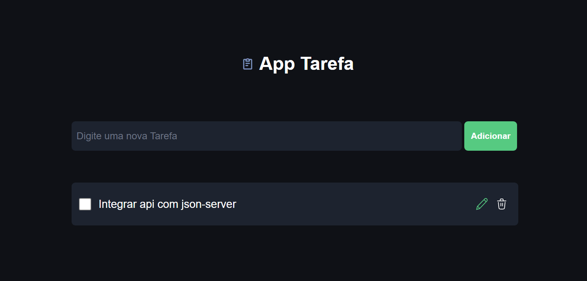
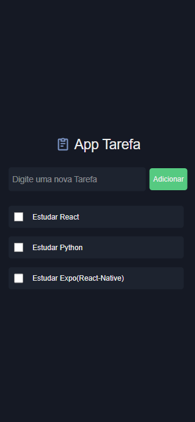

# 📝 App de Tarefas — Next.js + TailwindCSS

Este é um projeto front-end de uma aplicação simples de tarefas, desenvolvido com **Next.js** e **TailwindCSS**, utilizando design e paleta de cores extraídos diretamente do Figma.

---

## 🚀 Tecnologias Utilizadas

- **Next.js — v16.2.0**
- **TailwindCSS — v4.0.0**
- **Ícones** importados do Figma
- **Paleta de cores** retirada do projeto no Figma

---

## 🎨 Design (Figma)

🔗 **Link do Figma:**  
https://www.figma.com/design/iXQudQluaXp8RN6hPJzl8P/AppTarefaNext?t=4J4gsBm002T9DtuL-0

---

## 📄 Sobre o Projeto

- Projeto **front-end** de uma aplicação de tarefas
- Contém **apenas 1 página** (Página de Tarefas)
- Interface totalmente **responsiva** (Desktop e Mobile)

---

## 💻 Versão Desktop

---

## 📱 Versão Mobile

